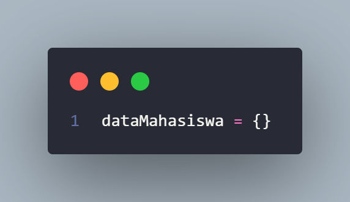

# Pratikum 6

Nama  : Chaerul Hidayat  
Nim   : 312210300  
Kelas : T.I.22.A.3  

<h1>Penjelasan :</h1>

1. Untuk Menanmpung DATA MAHASISWA  
   
2. [def tambah()]() untuk menambahkan data mahasiswa yang di input  
   
3. [def tampilkan()]() untuk menampilkan hasil data yang tadi kita tambah dengan [def tambah()]()   
  
4.[ def hapus(nama):]() untuk menghapus data yang telah di input   
  
5. [def ubah(nama):]() untuk mengubah atau mengedit data yang udah tersimpan   
  
6. abis ituh di lakukan perulangan menggunakan [WHILE]() 
jika data = 1, pilih tambah  
jika data = 2, tampilkan data mahasiswa nya  
jika data = 3, untuk menghapus data  
jika data = 4, untuk mengedit atau mengubah data  

## **Inilah Hasil outpout nya untuk setiap data** 
1. MENAMBAH DATA   
  
2. MENAMPILKAN DATA   
  
3. MENGHAPUS DATA   
  
4. UNTUK MENGUBAH ATAU EDIT DATA   
< br>
  

## DAN INI FULL INPUT CODINGAN NYA 

  

## DAN INI FLOWCHARTNYA 
   
 Terima Kasih